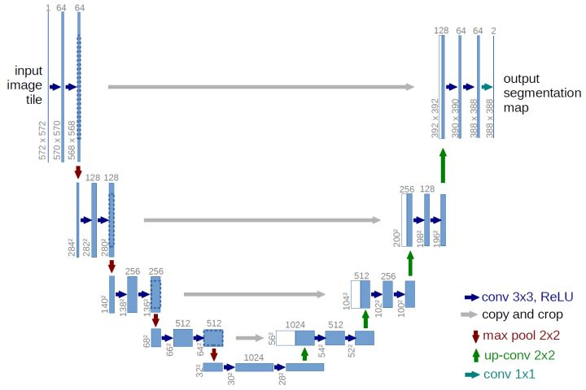

# read me

fcn上采样合并方式是逐点相加，u-net是拼接。

reference:
<https://zhuanlan.zhihu.com/p/31428783>

已下载数据：
冰雪：  LC82171112014297LGN00.tar.gz    LC80060102014147LGN00.tar.gz

森林：  LC82290572014141LGN00.tar.gz
灌木：  LC80630152013207LGN00.tar.gz

城市：  LC80460282014171LGN00.tar.gz
荒地：  LC81390292014135LGN00.tar.gz    LC81570452014213LGN00.tar.gz

水面：  LC80430122014214LGN00.tar.gz
湿地：  LC81080182014238LGN00.tar.gz