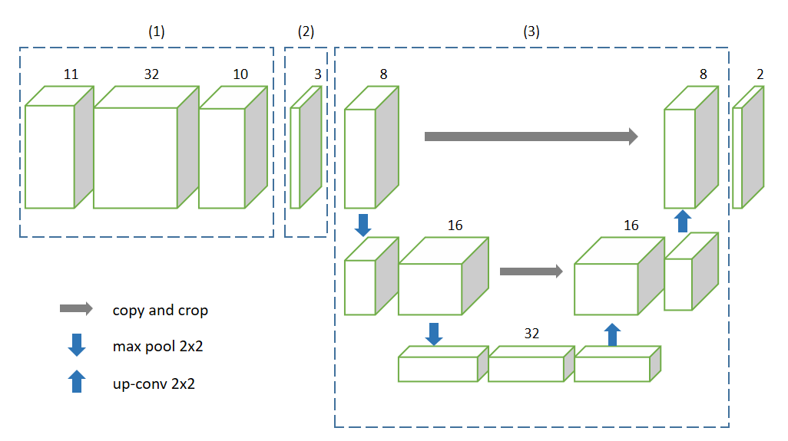
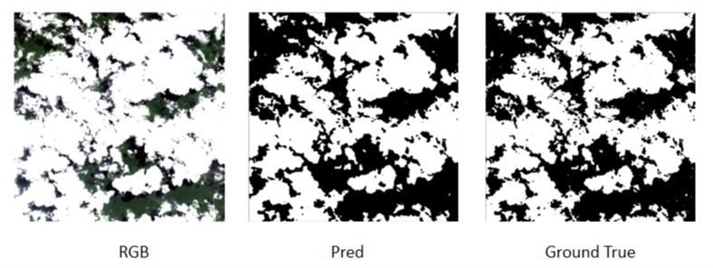

# S-Net: Spoon Networks for Cloud Masking of Landsat8 Imagery

## Abstract

With the development of neural network, full convolutional neural network has been applied to remote sensing image cloud detection. However, most of the algorithms do not consider the characteristics of remote sensing image, and there is little innovation and change to the full convolution neural network. In this paper, considering the multi band characteristics of remote sensing image and the influence of complex underlying surface of cloud detection, a simple and effective network, called S-Net, is proposed.

## 1. Introduction

Since 2011, Landsat8/OLI has been collecting high quality imagery of the earth at least every 16 days. Free and open to the public, with global wall-to-wall coverage of land surfaces at an ecologically meaningful spatial resolution, Landsat imagery is one of the most useful resources for ecological monitoring and wildland management. But harnessing the power of the Landsat archive to detect and describe change on the earth’s surface hinges on researchers’ ability to detect and aggregate clear-sky observations uncontaminated by clouds.

Because of this necessity, screening for clouds has always been essential for remote imagery. For a single scene, information of spectrum and space are utilized to detect cloud. A common routine is to design spectral features first, and then use spatial features for post-processing.

In the last decade, deep Convolutional Neural Networks (CNN) have revolutionized image recognition. For image segmentation, which is the process of assigning a label to every pixel in computer vision, Fully Convolutional Network(FCN) is a pioneering work, which all layers in the network are convolutional. FCN has powerful ability of spatial feature extraction. There are many methods use FCN to remote sensing image cloud detection.

However, FCN was originally designed for RGB images. Applying FCN to remote sensing image without any change will cause huge waste of computing resources. And as mentioned before, spectral features are the most essential features of ground objects, and it seems to put the cart before the horse to over emphasize spatial features.

To solve these problems, we propose a spoon convolution network, which is divided into three parts. Firstly, 1 x 1 convolution kernel is used to extract the spectral features of the image; secondly, in order to adapt to the complex underlying surface, variance is used to select the feature map generated in the first step; thirdly, a simple network similar to U-Net is used to extract and predict the spatial features of the ground objects.

## 2. Materials and Methods

### 2.1 Training and Evaluation Data

The test data of this paper is from USGS official website(<https://landsat.usgs.gov/landsat-8-cloud-cover-assessment-validation-data>).This is a manually labeled data set, including 8 kinds of underlying surfaces(includding Barren, Forest, Grass/Crops, Shrubland, Snow/Ice, Urban, Water, Wetlands), each of which has 12 scenes, and each scene file has 11 bands of Landsat 8, QA band and manual annotation band labels.

Each large picture is cut into 512 * 512 small pictures, and the ratio of training set and verification set is 2:8

### 2.2 Network Architechture

As is shown in the figure below, our model include three parts.

In the first part, we only use 1 x 1 convolution kernel, which aim is extract the spectral features of the target. This step will make our algorithm more efficient. In the second part, variance is used to select the feature map generated in the first part. As is known to all, the diversity of underlying surface will have a great impact on cloud detection. In the training process, the underlying surface of each image is the same, so we hope to select the features of the underlying surface suitable for each image through this step. Because the human eye can recognize the cloud through the color image, we choose the three characteristic images with the largest variance. In the third part, we want to utilize spatial information, a simple net similar to U-Net is used.

## 3. Experience and Evaluation

As shown in the figure above, S-Net can fit ground true well.

摘抄：
Spectral information is the most important characteristic of HSIs and plays the vital role for the classification tasks
